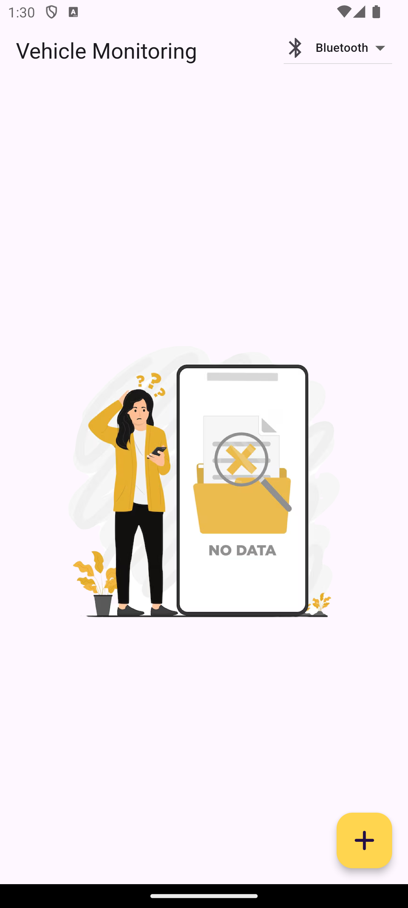
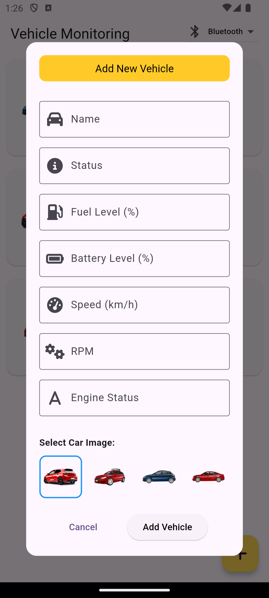
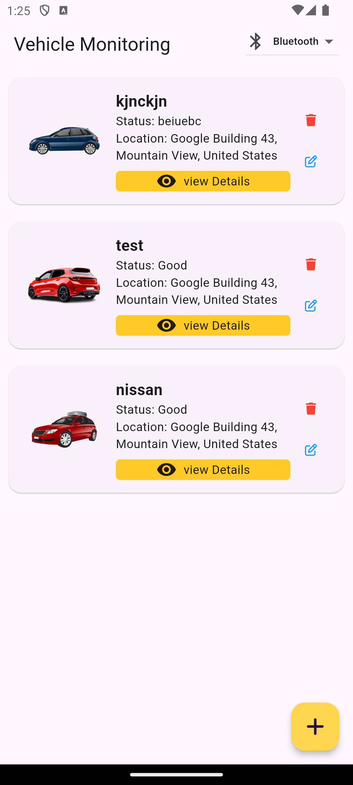
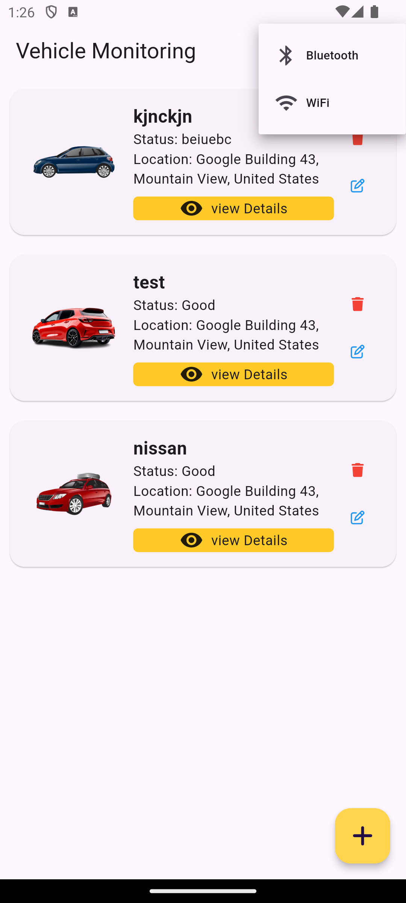
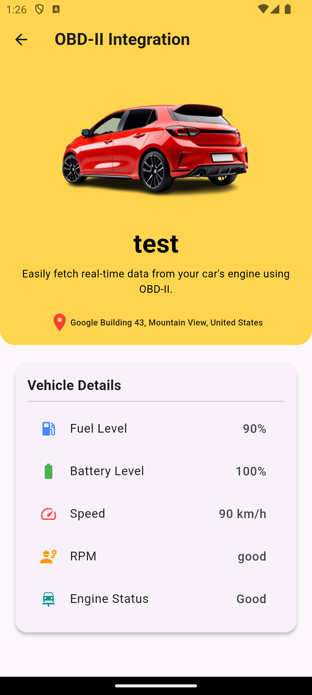
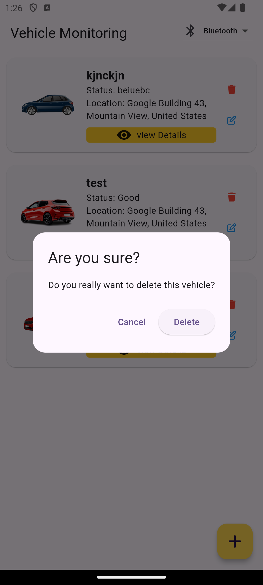
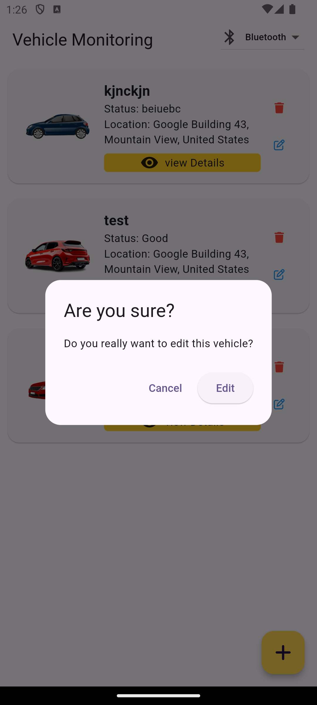
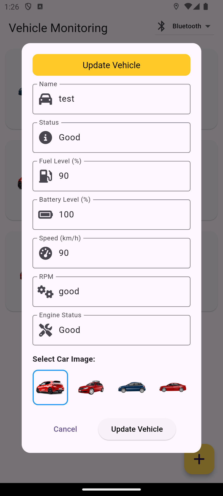

# Flutter App Example

This is a  simple vehicle monitoring app.

## Screenshot

Here are some screenshots from the app for your test:

<div style="display: inline-block; padding: 10px;">
  
</div>
<div style="display: inline-block; padding: 10px;">
  
</div>
<div style="display: inline-block; padding: 10px;">
  
</div>
<div style="display: inline-block; padding: 10px;">
  
</div>
<div style="display: inline-block; padding: 10px;">
  
</div>
<div style="display: inline-block; padding: 10px;">
  
</div>
<div style="display: inline-block; padding: 10px;">
  
</div>
<div style="display: inline-block; padding: 10px;">
  
</div>

## Installation

Follow these steps to get the app running on your local machine:

1. **Clone the repository**:
   ```bash
   git clone https://github.com/awolkiyya/vehicle-monitoring.git
