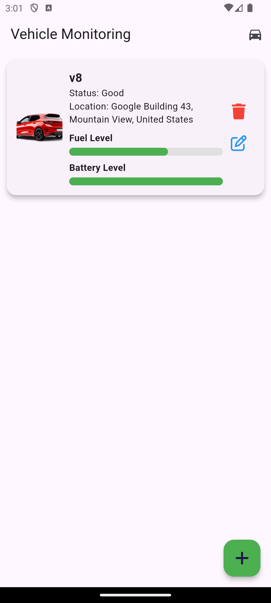
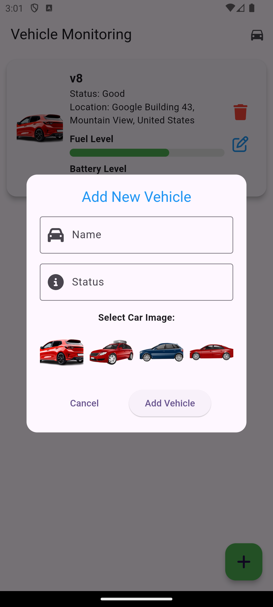
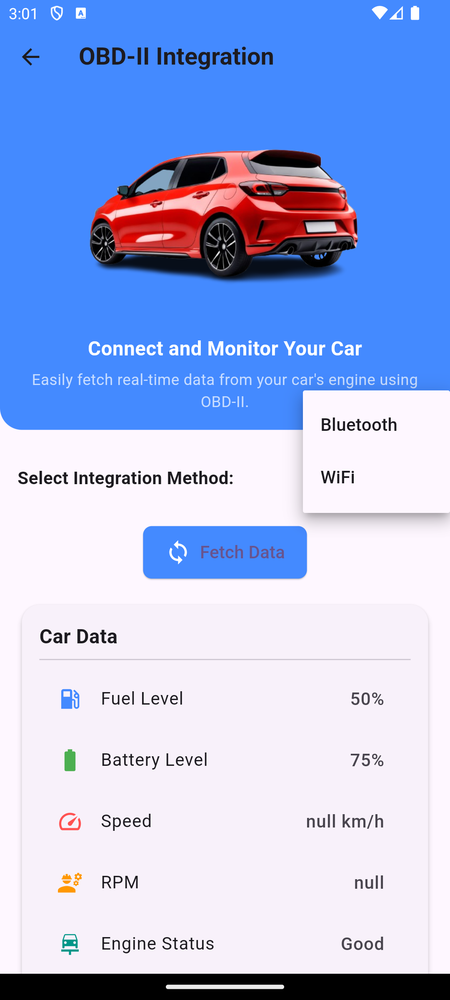

# Flutter App Example

This is a simple Flutter app to demonstrate how to integrate a screenshot into a README.

## Screenshot






## Features

- User authentication
- Bluetooth integration
- Real-time data display

## Installation

1. Clone the repository:
   ```bash
   git clone https://github.com/your_username/flutter_app_example.git
